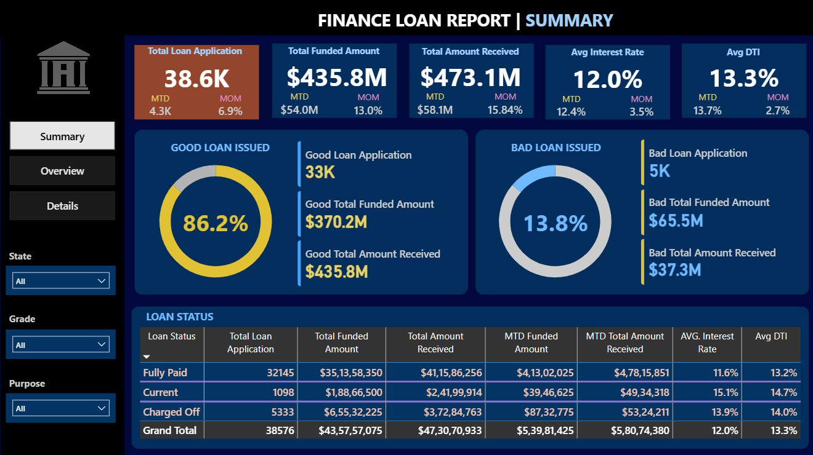
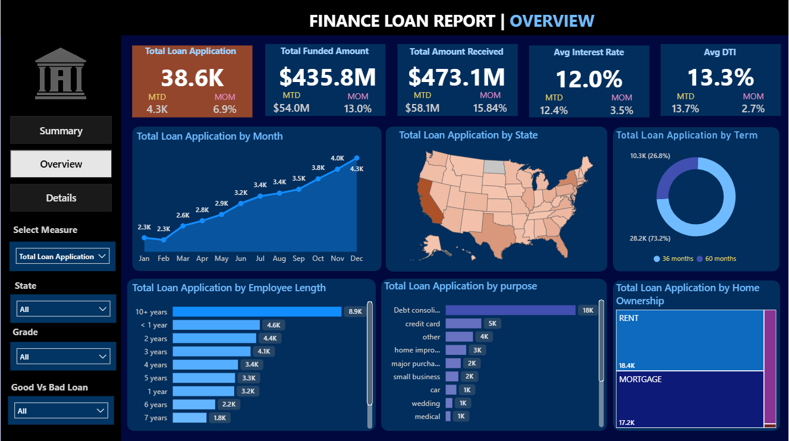
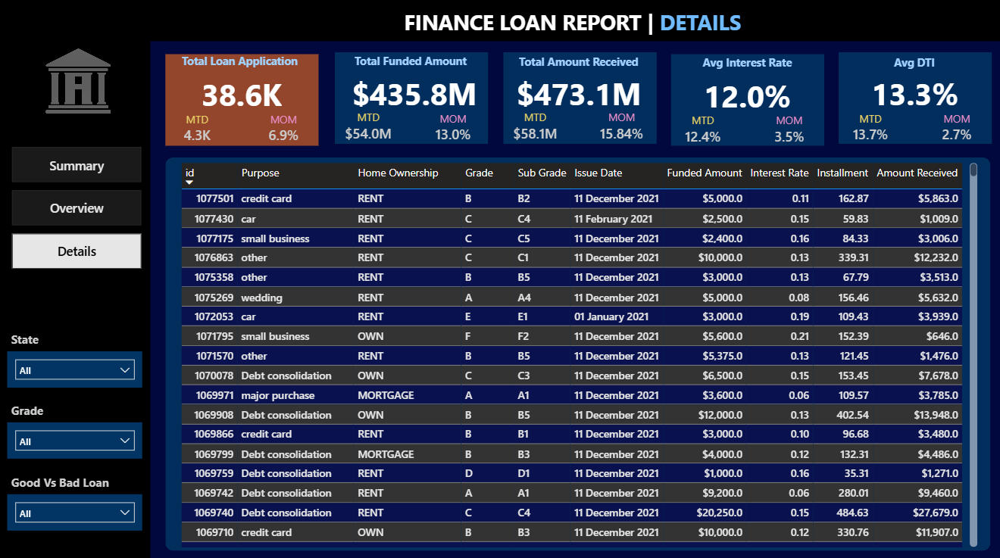

# Financial_Loan_Analysis_Dashboard
An end-to-end Power BI report analyzing financial loan performance, credit risk, and portfolio growth using Power Query, DAX time-intelligence measures, and interactive dark-theme dashboards.

# 📊 Finance Loan Portfolio & Risk Analysis | Power BI Project

An end-to-end interactive Power BI solution designed to evaluate loan portfolio performance, track capital growth velocity, monitor default risks, and analyze borrower demographics across the United States.

---

## 📌 Project Overview

Understanding credit risk and portfolio health is critical for financial institutions to make data-driven decisions, optimize lending strategies, and minimize default exposure. 

This project transforms raw transactional lending data into an executive-ready, multi-page Power BI report featuring automated ETL in Power Query, dynamic DAX calculations, and an intuitive dark-themed visual layout.

---

## 🖼️ Dashboard Preview

### 1. Summary View


### 2. Overview View


### 3. Details View


---

## 📈 Key Business Insights

* **Portfolio Scale:** Analyzed **38.6K total applications**, representing **$435.8M in total funded capital** and **$473.1M in total amount received**.
* **Risk Breakdown:**
  * **Good Loans (86.2%):** Generated **$370.2M** in funded value with healthy repayment behavior.
  * **Bad Loans / Charged-Off (13.8%):** Accounted for **$65.5M** in funded capital, identifying key focus areas for risk mitigation and underwriting adjustments.
* **Growth Velocity:** Achieved a **13.0% Month-over-Month (MoM) increase** in funded amount ($54.0M MTD), with **Debt Consolidation** and **Credit Card Refinancing** serving as the primary demand drivers.
* **Portfolio Averages:** Maintained an **Average Interest Rate of 12.0%** and an **Average Debt-to-Income (DTI) ratio of 13.3%**.

---

## 🛠️ Technical Architecture & Workflow

### 1. Data Engineering & ETL (Power Query Editor)
* Extracted and cleaned raw banking datasets.
* Handled missing values, standardized schemas, and resolved date/currency formatting issues.
* Added custom conditional columns to classify loan health categories (Good vs. Bad Loans).

### 2. Advanced DAX & Time Intelligence
* Created custom measures for dynamic time-intelligence evaluations: **Month-to-Date (MTD)**, **Previous Month-to-Date (PMTD)**, and **Month-over-Month (MoM %)**.
* Implemented safe ratio evaluations using `DIVIDE()` to eliminate division-by-zero errors.
* Applied proper percent formatting to ensure precise KPI output.

### 3. Visual UI/UX Design
* Designed a custom dark-mode theme featuring structured visual hierarchy and intuitive page navigation.
* Incorporated custom dynamic cards, slicers, map projections, and interactive cross-filtering.

---

## 📂 Repository Structure

```text
├── Data/
│   └── Financial_Loan_Data.csv       # Raw/Sample dataset
├── Dashboard/
│   └── Finance_Loan_Report.pbix      # Power BI Desktop report file
├── Images/
│   ├── Summary_Page.png              # Dashboard screenshots
│   ├── Overview_Page.png
│   └── Details_Page.png
└── README.md                         # Project documentation
